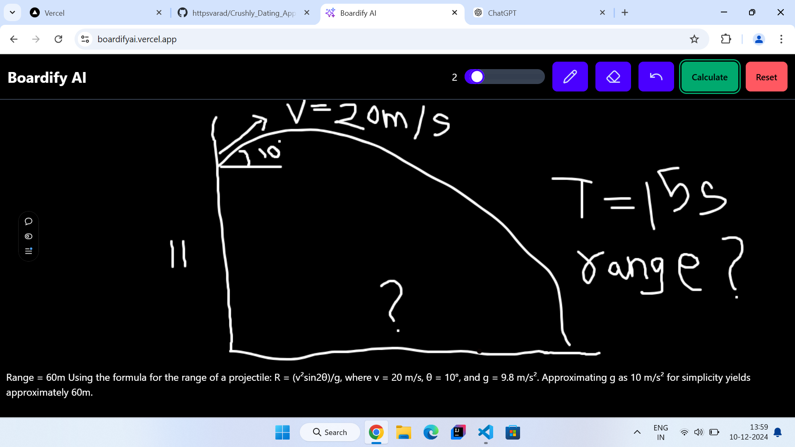
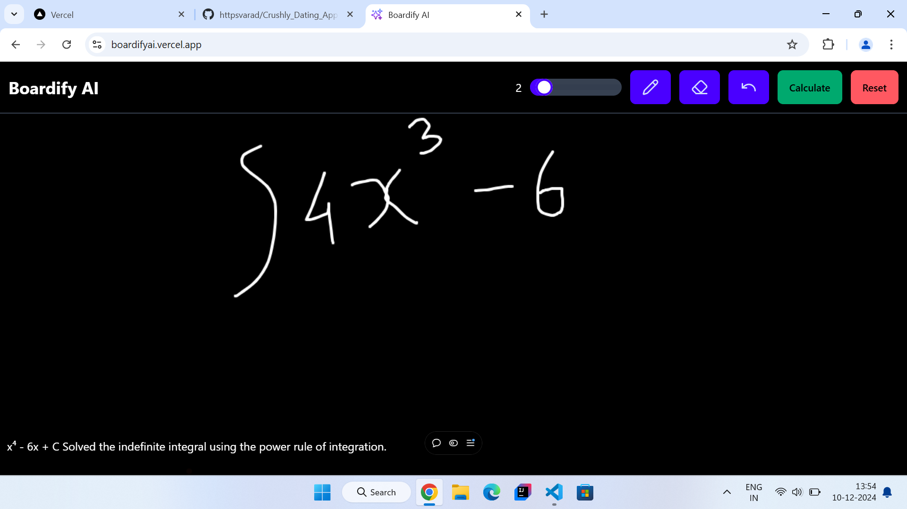

# Boardify AI 📐  

**Boardify AI** is an intelligent web application that solves mathematical problems written or drawn on a digital board.

---

## 🛠️ **Tech Stack**

### **Frontend**:
- **React.js**: For a dynamic and interactive user interface.  
- **Tailwind CSS**: For styling and responsiveness.

### **Backend**:
- **Node.js**: Ensuring scalability and efficiency.  
- **Express.js**: For routing and API handling.

### **AI Integration**:
- **Gemini API**: Provides computation and advanced problem-solving capabilities.  

---

## 🌐 **Live Link**:  
   https://boardifyai.vercel.app/

---

## Screenshots 📸  

 

 

 

---

## **Developed By**

- **Varad Manegopale**
- Have questions or need help? Reach out via:  
📧 Email: varad.manegopale28@gmail.com  
💼 LinkedIn: https://www.linkedin.com/in/varadmanegopale/

Happy Coding! 🎉
